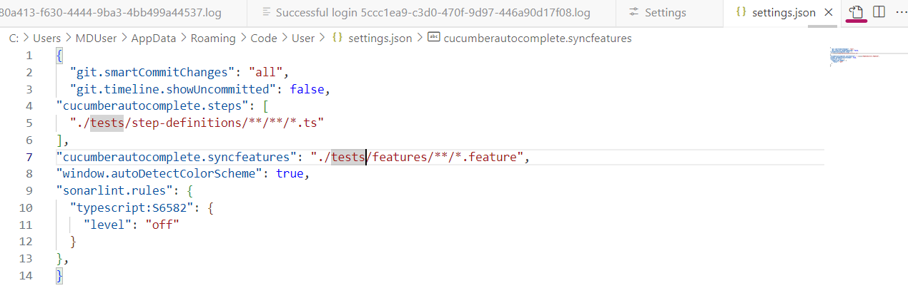
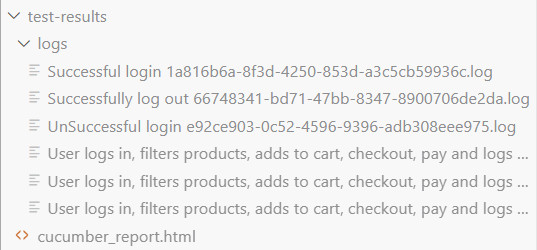

# EshopOnWeb Application Technical Test

### Introduction

This project includes a combination of UI and API automated tests developed for the eShopOnWeb application. The tests aim to provide fast feedback on core functionality, ensuring that key features like user login, shopping cart operations,log out and catalog item CRUD actions work as expected. The README outlines the testing approach, tools used, setup instructions, and how to run the tests.

### **Testing Approach**

For this challenge, I designed the tests to provide **fast feedback** on both the **UI** and **API functionality** of the application. Here's the approach and rationale:

#### **UI Testing**:
- **Purpose**: Validate key user workflows, such as logging in, adding products to the cart, and checking out.
- **Tools**: I used **Cucumber** with **Playwright** and **Typescript** to automate the browser interactions and simulate user behavior.
- **Scenarios**: The tests cover login flows (successful and unsuccessful), the complete shopping journey, and logout functionality.
  
#### **API Testing**:
- **Purpose**: Verify the CRUD operations for catalog items through the REST API.
- **Tools**: I used **Axios** with **Cucumber** and **Typescript** to perform HTTP requests and validate the responses.
- **Scenarios**: API tests focus on creating, updating, retrieving, and deleting catalog items. Negative test cases are also included to ensure proper error handling.

#### **Why this Approach?**
- **Coverage**: This approach ensures coverage for both frontend (UI) and backend (API) functionalities.
- **Fast Feedback**: The tests target critical functionalities, providing fast and actionable feedback on the application’s health.
- **Scalability**: The test suite is modular, parameterised scenarios (Refer to user-shopping-journey.feature for example) where applicable and can be easily extended to add more complex scenarios in the future.

### Prerequisites

Ensure you have the following installed on your machine:
- **Node.js** (version 18.12.1 or higher)- I have used 21.1.0
- **npm** (Node Package Manager)
- **Git** (for commiting code)
- **Docker**(To run application)

### Installation Instructions

1. **Clone the Repository by using git clone https://github.com/instanda-technicaltest/eShopOnWeb.git**
   --bash
   git clone >git clone https://github.com/instanda-technicaltest/eShopOnWeb.git

2. **Navigate to the Project Directory using cd **eShopOnWeb**
   cd eShopOnWeb

3. **Switch to the Correct Branch Api_Automation using git checkout QA_Technical_Test**
    git checkout QA_Technical_Test

4. **Open cloned repository in visual studio code ide**

5. **Deploy the Application:**
   Follow the instructions in the docker-compose section of the eShopOnWeb repository to deploy the application.

6. **Enter settings.json in vscode as shown below**
   {
  "git.smartCommitChanges": "all",
  "git.timeline.showUncommitted": false,
  "cucumberautocomplete.steps": [
  "./tests/step-definitions/**/**/*.ts"
],
"cucumberautocomplete.syncfeatures": "./tests/features/**/*.feature",
"window.autoDetectColorScheme": true,
"sonarlint.rules": {
  "typescript:S6582": {
    "level": "off"
  }
},
}
   

6. **Click on "open in integrated terminal option" by right clicking "tests" folder**

7. **Install Dependencies by using npm install- this will install all dependencies specified in package.json**
--Enter npm install 
 eg:-C:\Users\MDUser\NewAutomation\Technical-Test\eShopOnWeb\tests> npm install

8. **Run all tests**
**API Tests**
-C:\Users\MDUser\NewAutomation\Technical-Test\eShopOnWeb\tests> npm run apitests
-package.json contains script called apitests which runs all tests with tag @APIRegression, can change tags if needed and rerun
**UI Tests**
-C:\Users\MDUser\NewAutomation\Technical-Test\eShopOnWeb\tests> npm run uitests
-package.json contains script called apitests which runs all tests with tag @UIRegression, can change tags if needed and rerun

8. **View test results folder for report and logs**

### Project Structure**

 #### **features/**: Contains the Gherkin feature files, each describing a below set of scenarios 

   - **UI Test Scenarios:/**
      **Login Tests:**
       ✅ Successful login with valid credentials.
       ❌ Unsuccessful login with invalid credentials.
      **Logout Tests:**
       ✅ User successfully logs out of the application.
      **Shopping Journey:**
       ✅ User logs in, filters products, adds items to the cart, proceeds to checkout, and successfully completes the purchase.

   - **API Test Scenarios:/**
      **Create Catalog Item:**
       ✅ Verifies creating a new catalog item via the /catalog-items API endpoint.
      **Update Catalog Item:**
       ✅ Verifies updating an existing catalog item using the PUT /catalog-items endpoint.
      **Retrieve Catalog Item:**
       ✅ Retrieves catalog items filtered by catalogBrandId and catalogTypeId.
       **Negative Tests:**
       ❌ API returns 400 for missing required data during catalog item creation.
       ❌ API returns 500 for invalid data provided in catalog item creation.

 - **step-definitions/**: Contains the step definitions that implement the steps in the Gherkin files.
        Example: All assertions are implemented api-assertions.ts, ui-assertions for api and ui tests respectively.
        login-steps.ts, logout-steps.ts,user-shopping-journey-steps.ts,catalog-items-steps contains steps of  respective feature files.
             
 - **package.json/**: The configuration file for npm, containing scripts and dependencies.

 - **world.ts/**: All cucumber hooks are defined in this file.

### Logger Implementation (`logger.ts`)

The `logger.ts` file contains a custom logging utility that provides consistent and formatted logging throughout the framework. It helps in tracking the execution flow, debugging, and capturing important information or errors during test runs.

- **Usage**: The logger is used in various parts of the code to log messages, warnings, and errors.
- **Customization**: You can customize the logging levels (e.g., info, debug, error) as needed.

### Environment Configuration (`.env`)

The `.env` file is used to manage environment-specific configurations, such as API base URLs, credentials, and other sensitive information. This allows the tests to run against different environments (e.g., development, staging, production) without changing the code and easy to integrate in pipeline.
Please note as it also contains both UI And API tests, so to run API tests use APItesting.env and for UI tests use dev.env.

- **Usage**: Environment variables defined in the `.env` file are accessed using `process.env.VARIABLE_NAME`.
- **Examples**: 
  - `API_BASE_URL=http://localhost:5106`
  - `MESSAGE=In test Environment`

### Dependencies:

- This project uses Playwright and Cucumber for testing.
- Axios is used for making HTTP requests within the step definitions.
- TypeScript is used for strict typing and better maintainability.